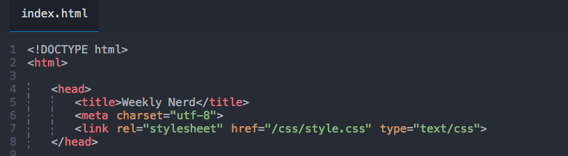

# Weekly Nerd

> Sketchnotes and articles based on the Weekly Nerd talks.

https://dandevri.github.io/minor-wn/

## :book: Introduction
Every Tuesday during the Minor designers and developers, from some of the biggest agencies in the Netherlands, come to give a talk about interesting and relevant topics in the design world.

**Assignment**
> Based on these talks you make sketchnotes and write 5 in-depth articles about, for you personally, interesting topics.

### List of Weekly Nerds
1. Stephen Hay (Catawiki) - Ux ?= FeD
1. Justus Sturkenboom (HvA) - Sketchnotes
1. Peter Paul Koch (PPK) - Browser bloat
1. Titus Wormer (HvA) - Advanced Git Tips & Tricks
1. Bram Duvigneau - Accessibility
1. Jasper Moelker (Voorhoede) - DevLovesDes
1. Peter Peerdeman (Lifely) - RTW en GraphQL
1. Niels Leenheer (HTML5test) - Obscure browsers
1. Nick de Bruijn - Een eigen bedrijf door en met CMD'ers
1. Guido Bouman (Q42) - Interaction Engineering

### List of articles
1. [Article 1 -  My write up of CSS Day Conference ‘17. ](https://medium.com/@dandevri/my-write-up-of-css-day-conference-17-eb6db74b5268)
1. [Article 2 - Back to JS Basics](https://codeburst.io/back-to-js-basics-22746226cbec)
1. [Article 3 - Using GitHub as a team.](https://medium.com/@dandevri/using-github-as-a-team-61f189eaa8ff)
1. [Article 4 - Building conversational UI demystified](https://medium.com/@dandevri/building-conversational-ui-with-wit-ai-demystified-77edfe749ca2)

## :page_facing_up: Contributing
To see a list of everybody who participated go to the [Contributors](https://github.com/dandevri/watt-now/graphs/contributors) page.

## 👋 Holla at me
You can always contact me if you wanna talk.

[Twitter](https://twitter.com/dandevri)  
[Instagram](https://instagram.com/dandevri)  
[Website](www.dandevri.es)

## 📃 License
This project is licensed under the [MIT](LICENSE.MD) License
